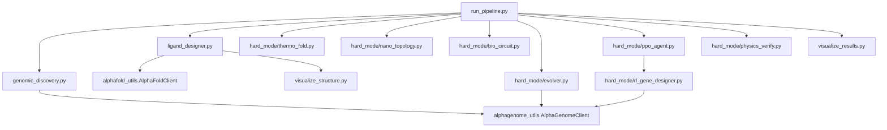

# Geno-Thermal Targeting Codebase Map

Generated after indexing the repository with GitNexus.

## GitNexus Status

GitNexus is installed and this repo is indexed as `GenoThermal_Targeting`.
The current index contains 428 symbols, 796 relationships, and 35 execution
flows (see `AGENTS.md` / `CLAUDE.md` for the live count).

The local Windows LadybugDB native extensions `fts` and `VECTOR` segfault with
exit code `0xC0000005`. The installed GitNexus adapter has been guarded on this
machine to skip those extensions, which makes graph-backed `context`, `impact`,
`cypher`, resources, and generated skills usable. Full-text `query` may return
empty results; use Cypher name/path searches as the reliable fallback.

Commands attempted:

```powershell
gitnexus analyze --skills --skip-agents-md
gitnexus analyze --skills --skip-agents-md --max-file-size 128
npm exec --yes --package node@22 -- node %APPDATA%\npm\node_modules\gitnexus\dist\cli\index.js analyze --skills --skip-agents-md --max-file-size 128
```

Observed native-extension blocker:

```text
LOAD EXTENSION fts
LOAD EXTENSION VECTOR
exit code: -1073741819 / 0xC0000005
```

## System Shape

This is a Python research pipeline for patient-specific magnetic nanoparticle
therapy design. The top-level orchestrator is `run_pipeline.py`, which chains
genomic discovery, ligand docking job generation, thermo-switch design,
nanoparticle topology optimization, biological circuit simulation, promoter
evolution, PPO sequence generation, optional OpenMM verification, and result
visualization.



## Primary Entry Points

| Entry point | Role |
| --- | --- |
| `run_pipeline.py` | Master phase orchestrator; shells out to each phase and logs to `pipeline_master.log`. |
| `genomic_discovery.py` | Phase 1 CLI; reads FASTA input and writes `outputs/reports/target_report.json`. |
| `ligand_designer.py` | Phase 2 CLI; creates AlphaFold Server docking jobs and parses cached results. |
| `hard_mode/evolver.py` | Phase 4 genetic algorithm for tumor/heat-biased synthetic promoter design. |
| `hard_mode/thermo_fold.py` | Phase 5 simplified thermodynamic optimizer for a thermo-labile protein switch. |
| `hard_mode/nano_topology.py` | Phase 6 lattice Monte Carlo nanoparticle surface optimizer. |
| `hard_mode/bio_circuit.py` | Phase 7 AND-gate simulation for tumor context plus hyperthermia. |
| `hard_mode/ppo_agent.py` | Phase 8 Stable-Baselines3 PPO trainer/generator for promoter sequences. |
| `hard_mode/physics_verify.py` | Phase 9 OpenMM molecular dynamics verification, gated by OpenMM availability. |
| `visualize_results.py` | Phase 10 visualization of GA fitness/component trajectories. |
| `visualize_structure.py` | Interactive py3Dmol 3D viewer for folded/docked structures (CIF/PDB). |
| `geno_thermal_master.py` | Standalone, headless .py port of `Geno_Thermal_Master.ipynb` — the original narrative AlphaFold-Server-based pipeline (Phases 1-9 + summary) as one script, all charts saved to `outputs/figures/`. Independent of `run_pipeline.py`, which orchestrates the newer Boltz-2 + RunPod Flash production pipeline as separate phase scripts. |

## Source Modules

### API / Model Clients

`alphagenome_utils.py`

- Defines `AlphaGenomeClient`.
- Uses the real `alphagenome` package when installed and an API key is present.
- Falls back to local motif heuristics for expression and sequence fitness.
- Provides session-level in-memory sequence fitness caching.

`alphafold_utils.py`

- Defines `AlphaFoldClient`.
- Generates AlphaFold Server JSON job specs.
- Parses result ZIPs/directories, extracts the best model by confidence proxy,
  and copies selected structures into `outputs/predicted_structures/`.
- Classifies binders by pLDDT thresholds.

### Pipeline Shells

`genomic_discovery.py`

- CLI wrapper around `AlphaGenomeClient`.
- Input: FASTA-like sequence file, target gene, optional API key.
- Output: `outputs/reports/target_report.json`.

`ligand_designer.py`

- CLI wrapper around `AlphaFoldClient`.
- Input: target protein sequence plus candidate peptide CSV.
- Output: AlphaFold job JSON and optionally parsed candidate CSV.

`summary_report.py`

- Lightweight terminal report reader for `outputs/reports/target_report.json` and
  `outputs/reports/candidate_library.csv`.

`visualize_results.py`

- Reads `outputs/reports/evolution_log.csv`.
- Writes `outputs/figures/evolution_trajectory.png`.

`visualize_structure.py`

- Input: a `.cif`/`.pdb` path or a job-name fragment, resolved against
  `outputs/predicted_structures/`, `outputs/alphafold_results/`, `outputs/simulated_pdbs/`.
- Parses chains with Biopython, renders with `py3Dmol` (one color per chain),
  optionally overlays `chain_iptm` from the matching `summary_confidences_*.json`.
- Writes a standalone interactive `outputs/figures/<job_name>_3d.html`.

### Hard Mode Research Modules

`hard_mode/evolver.py`

- Classes: `AlphaGenomeOracle`, `GeneticOptimizer`.
- Function: `calculate_fitness`.
- Combines motif/API fitness, tournament selection, elitism, crossover, and
  adaptive mutation-rate escalation after stagnation.

`hard_mode/thermo_fold.py`

- Classes: `ProteinPhysicsOracle`, `ThermoSwitchOptimizer`.
- Uses a simplified two-state thermodynamic model to tune a leucine zipper-like
  scaffold toward a target melting temperature.

`hard_mode/nano_topology.py`

- Class: `NanoTopologySim`.
- Uses a toroidal 2D lattice with ligand, PEG, and empty cells.
- Optimizes surface arrangement with Metropolis-style annealing.

`hard_mode/bio_circuit.py`

- Class: `BioCircuitSimulator`.
- Models promoter activity and switch activation as a multiplicative kill
  signal across normal/tumor contexts and temperature.

`hard_mode/rl_gene_designer.py`

- Classes: `SequenceJudge`, `PromoterDesignEnv`.
- Defines the Gymnasium environment where the agent writes DNA one base at a
  time and gets sparse terminal reward from AlphaGenome or local heuristics.

`hard_mode/ppo_agent.py`

- Class: `ProgressCallback`.
- Functions: `train_agent`, `generate_sequence`.
- Trains Stable-Baselines3 PPO against `PromoterDesignEnv` and writes
  `hard_mode/best_promoter_agent.zip`.

`hard_mode/physics_verify.py`

- Functions: `fix_pdb`, `setup_simulation`, `run_md_protocol`,
  `calculate_rmsd`, `verify_thermal_switch`.
- Requires OpenMM; optionally uses `pdbfixer`.
- Runs 37 C and 43 C simulations and compares RMSD for switch behavior.

### RunPod Flash Layer (parallel entry points)

A second set of root-level scripts reimplements the GPU-heavy stages as RunPod
Flash autoscaling endpoints (0 -> N workers -> 0), opt-in via `GENOTHERMAL_FLASH=1`
or `--flash`. See `METHODS.md` for metric definitions and `FLASH_HACKATHON_NOTES.md`
for the build log.

| Module | Replaces / extends | Role |
| --- | --- | --- |
| `flash_boltz.py` | `alphafold_utils.py` | Boltz-2 fold + binding-affinity Flash endpoint. |
| `boltz_designer.py` | `ligand_designer.py` | Phase 2 driver; fans candidates out to `flash_boltz.py`. |
| `flash_fitness.py` | `hard_mode/evolver.py` scoring | Self-contained GA fitness fan-out endpoint. |
| `flash_gpu_jobs.py` | `hard_mode/ppo_agent.py`, `hard_mode/physics_verify.py` | Self-contained PPO (with seed sweep) and OpenMM Flash workers; inlines the source-of-truth logic from those two modules so the worker ships no sibling imports. |
| `target_panel.py` | — | Multi-oncogene (EGFR/KRAS/HER2/BRAF) selectivity panel; folds every candidate against every target. |
| `fetch_targets.py` | — | Builds `data/sample_data/targets.csv` from exact, domain-trimmed UniProt sequences. |
| `leaderboard.py` | — | Unifies peptide and small-molecule candidate-library rows into one ranked board. |
| `bright_data_intel.py` | — | Live target intelligence via the Bright Data SERP API, fanned out on Flash with a local-stub fallback. |
| `flash_metrics.py` | — | `FanoutMetrics`: per-job timing -> latency/throughput/peak-concurrency/cost, appended to `flash_metrics.json`. |
| `flash_dashboard.py` | — | Renders `flash_metrics.json` into `outputs/figures/flash_scaling.png` (concurrency step-chart + cost bar). |
| `preflight.py` | — | 12 local sanity checks covering every fallback path with no Flash SDK/GPU/heavy deps. |
| `make_demo_snapshot.py` | — | Builds the synthetic `outputs/reports/demo_metrics.json` / `outputs/figures/flash_scaling.png` fallback for demo-stall recovery. |

### Claude Science MCP Layer

`mcp_geno_thermal.py` exposes the pipeline to Claude as an MCP stdio server
(registered in `.mcp.json` as `geno-thermal-targeting`, launched with
`.venv-flash/bin/python`). It wraps existing modules rather than reimplementing
them: `discover_target` -> `alphagenome_utils.AlphaGenomeClient`,
`design_ligands` -> `boltz_designer.py`, `design_thermal_switch` ->
`hard_mode/thermo_fold.ThermoSwitchOptimizer`, `verify_with_bionemo` -> the
NVIDIA BioNeMo Boltz-2 NIM (local heuristic fallback without
`NVIDIA_API_KEY`), `run_full_pipeline` -> `run_pipeline.py`,
`design_promoter_flash` -> `hard_mode/evolver.py` (runs the GA's promoter
evolution, fanning per-individual fitness scoring out on the RunPod Flash
GPU/CPU fleet when `use_flash=True`, autoscaling 0->N->0, and returning the
live autoscaling metrics — peak concurrent workers, estimated cost, speedup —
alongside the best evolved promoter), and `screen_and_verify` chains all of
the above into one discover -> design -> verify call.
`.claude/skills/geno-thermal-targeting/SKILL.md` documents the loop and the
adversarial-verification reporting rule. Self-test with
`python mcp_geno_thermal.py --selftest`.

## Data And Artifact Ownership

| Path | Owner / Producer | Notes |
| --- | --- | --- |
| `data/sample_data/` | Inputs | FASTA and candidate CSV inputs. |
| `outputs/reports/target_report.json` | `genomic_discovery.py` | Genomic marker report. |
| `candidate_library*.csv` | `ligand_designer.py` | Parsed or cached ligand candidate data. |
| `outputs/alphafold_jobs/` | `AlphaFoldClient` | Generated AlphaFold Server job specs. |
| `outputs/alphafold_results/` | Manual download + `AlphaFoldClient` | AlphaFold result ZIPs/directories. |
| `outputs/predicted_structures/` | `AlphaFoldClient` | Selected parsed structures. |
| `outputs/reports/evolution_log.csv` | `hard_mode/evolver.py` | GA history for visualization. |
| `outputs/figures/evolution_trajectory.png` | `visualize_results.py` | Final GA chart. |
| `outputs/figures/<job_name>_3d.html` | `visualize_structure.py` | Interactive 3D structure/docking viewer. |
| `outputs/figures/target_expression.png`, `docking_comparison.png`, `best_docking_3d.html`, `promoter_convergence.png`, `promoter_composition.png`, `nano_surface_coverage.png`, `circuit_heatmap_narrative.png`, `therapeutic_window.png` | `geno_thermal_master.py` | Narrative-pipeline charts (Phases 1, 3, 4, 6, 7), distinct filenames from the production phase scripts' own outputs. |
| `outputs/figures/thermo_profile.png` | `hard_mode/thermo_fold.py` | Thermo-switch curve. |
| `outputs/figures/nano_surface.png` | `hard_mode/nano_topology.py` | Nanoparticle topology map. |
| `outputs/figures/circuit_heatmap.png` | `hard_mode/bio_circuit.py` | Biological AND-gate safety plot. |
| `outputs/ppo_gene_tensorboard/` | `hard_mode/ppo_agent.py` | PPO logs. |
| `hard_mode/best_promoter_agent.zip` | `hard_mode/ppo_agent.py` | Trained PPO model artifact. |
| `data/sample_data/targets.csv` | `fetch_targets.py` | UniProt-derived, domain-trimmed target panel sequences. |
| `flash_metrics.json` | `flash_metrics.py` (`FanoutMetrics`) | Per-phase fan-out timing/cost records; read by `flash_dashboard.py`. |
| `outputs/figures/flash_scaling.png` | `flash_dashboard.py` | Concurrency step-chart + estimated-cost bar chart. |
| `outputs/reports/demo_metrics.json` | `make_demo_snapshot.py` | Synthetic fallback metrics for demo-stall recovery. |
| `outputs/figures/panel_selectivity_heatmap.png`, `outputs/reports/panel_selectivity*.csv` | `target_panel.py` | Multi-target selectivity matrix/heatmap. |
| `outputs/reports/leaderboard.csv` | `leaderboard.py` | Unified peptide + small-molecule ranked board. |
| `outputs/reports/target_intel.json` | `bright_data_intel.py` | Per-target live web intelligence (or local-stub fallback). |

## Key Runtime Dependencies

- Python: `numpy`, `pandas`, `matplotlib`, `seaborn`, `requests`, `biopython`,
  `alphagenome`, `gymnasium`, `stable-baselines3`, `logomaker`.
- Optional physics stack: `openmm`, `pdbfixer`.
- Optional GPU path: OpenMM CUDA/OpenCL platform detection in
  `hard_mode/physics_verify.py`.
- Optional RunPod Flash stack (`requirements-flash.txt`, driver-side only):
  the RunPod Flash SDK plus dashboard deps; worker-side heavy deps (e.g. Boltz-2,
  torch, openmm, stable-baselines3) are declared per-endpoint in each
  `@Endpoint(dependencies=...)` block, not centrally.
- Claude Science MCP layer: the `mcp` package, run via `.venv-flash/bin/python`
  (the only interpreter with `numpy`/`pandas`/`alphagenome` and `mcp` installed
  together; the plain `venv/` interpreter cannot run `mcp_geno_thermal.py`).

## Suggested GitNexus Retry Path

After meaningful source or agent-file changes, refresh the index:

```powershell
gitnexus analyze --force --skills
gitnexus status
gitnexus context AlphaGenomeClient -r Geno-Thermal_Targeting
gitnexus impact AlphaGenomeClient -r Geno-Thermal_Targeting
gitnexus cypher -r Geno-Thermal_Targeting "MATCH (n) WHERE toLower(n.name) CONTAINS 'pipeline' OR toLower(n.filePath) CONTAINS 'pipeline' RETURN n.name, n.filePath LIMIT 25"
```

The added `.gitnexusignore` keeps generated scientific outputs, notebooks,
logs, images, ZIPs, and cached model/results directories out of the graph.
