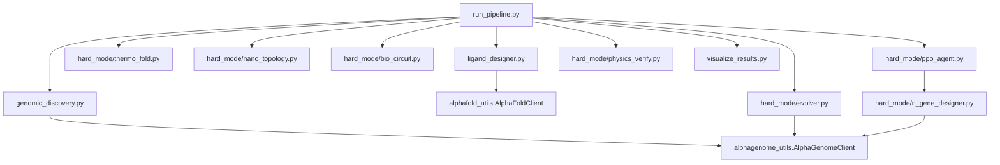

# Geno-Thermal Targeting Codebase Map

Generated after indexing the repository with GitNexus.

## GitNexus Status

GitNexus is installed and this repo is indexed as `Geno-Thermal_Targeting`.
The current index contains 469 symbols, 703 relationships, 25 clusters, and
15 execution flows.

The local Windows LadybugDB native extensions `fts` and `VECTOR` segfault with
exit code `0xC0000005`. The installed GitNexus adapter has been guarded on this
machine to skip those extensions, which makes graph-backed `context`, `impact`,
`cypher`, resources, and generated skills usable. Full-text `query` may return
empty results; use Cypher name/path searches as the reliable fallback.

Commands attempted:

```powershell
gitnexus analyze --skills --skip-agents-md
gitnexus analyze --skills --skip-agents-md --max-file-size 128
npm exec --yes --package node@22 -- node %APPDATA%\npm\node_modules\gitnexus\dist\cli\index.js analyze --skills --skip-agents-md --max-file-size 128
```

Observed native-extension blocker:

```text
LOAD EXTENSION fts
LOAD EXTENSION VECTOR
exit code: -1073741819 / 0xC0000005
```

## System Shape

This is a Python research pipeline for patient-specific magnetic nanoparticle
therapy design. The top-level orchestrator is `run_pipeline.py`, which chains
genomic discovery, ligand docking job generation, thermo-switch design,
nanoparticle topology optimization, biological circuit simulation, promoter
evolution, PPO sequence generation, optional OpenMM verification, and result
visualization.



## Primary Entry Points

| Entry point | Role |
| --- | --- |
| `run_pipeline.py` | Master phase orchestrator; shells out to each phase and logs to `pipeline_master.log`. |
| `genomic_discovery.py` | Phase 1 CLI; reads FASTA input and writes `target_report.json`. |
| `ligand_designer.py` | Phase 2 CLI; creates AlphaFold Server docking jobs and parses cached results. |
| `hard_mode/evolver.py` | Phase 4 genetic algorithm for tumor/heat-biased synthetic promoter design. |
| `hard_mode/thermo_fold.py` | Phase 5 simplified thermodynamic optimizer for a thermo-labile protein switch. |
| `hard_mode/nano_topology.py` | Phase 6 lattice Monte Carlo nanoparticle surface optimizer. |
| `hard_mode/bio_circuit.py` | Phase 7 AND-gate simulation for tumor context plus hyperthermia. |
| `hard_mode/ppo_agent.py` | Phase 8 Stable-Baselines3 PPO trainer/generator for promoter sequences. |
| `hard_mode/physics_verify.py` | Phase 9 OpenMM molecular dynamics verification, gated by OpenMM availability. |
| `visualize_results.py` | Phase 10 visualization of GA fitness/component trajectories. |

## Source Modules

### API / Model Clients

`alphagenome_utils.py`

- Defines `AlphaGenomeClient`.
- Uses the real `alphagenome` package when installed and an API key is present.
- Falls back to local motif heuristics for expression and sequence fitness.
- Provides session-level in-memory sequence fitness caching.

`alphafold_utils.py`

- Defines `AlphaFoldClient`.
- Generates AlphaFold Server JSON job specs.
- Parses result ZIPs/directories, extracts the best model by confidence proxy,
  and copies selected structures into `predicted_structures/`.
- Classifies binders by pLDDT thresholds.

### Pipeline Shells

`genomic_discovery.py`

- CLI wrapper around `AlphaGenomeClient`.
- Input: FASTA-like sequence file, target gene, optional API key.
- Output: `target_report.json`.

`ligand_designer.py`

- CLI wrapper around `AlphaFoldClient`.
- Input: target protein sequence plus candidate peptide CSV.
- Output: AlphaFold job JSON and optionally parsed candidate CSV.

`summary_report.py`

- Lightweight terminal report reader for `target_report.json` and
  `candidate_library.csv`.

`visualize_results.py`

- Reads `evolution_log.csv`.
- Writes `evolution_trajectory.png`.

### Hard Mode Research Modules

`hard_mode/evolver.py`

- Classes: `AlphaGenomeOracle`, `GeneticOptimizer`.
- Function: `calculate_fitness`.
- Combines motif/API fitness, tournament selection, elitism, crossover, and
  adaptive mutation-rate escalation after stagnation.

`hard_mode/thermo_fold.py`

- Classes: `ProteinPhysicsOracle`, `ThermoSwitchOptimizer`.
- Uses a simplified two-state thermodynamic model to tune a leucine zipper-like
  scaffold toward a target melting temperature.

`hard_mode/nano_topology.py`

- Class: `NanoTopologySim`.
- Uses a toroidal 2D lattice with ligand, PEG, and empty cells.
- Optimizes surface arrangement with Metropolis-style annealing.

`hard_mode/bio_circuit.py`

- Class: `BioCircuitSimulator`.
- Models promoter activity and switch activation as a multiplicative kill
  signal across normal/tumor contexts and temperature.

`hard_mode/rl_gene_designer.py`

- Classes: `SequenceJudge`, `PromoterDesignEnv`.
- Defines the Gymnasium environment where the agent writes DNA one base at a
  time and gets sparse terminal reward from AlphaGenome or local heuristics.

`hard_mode/ppo_agent.py`

- Class: `ProgressCallback`.
- Functions: `train_agent`, `generate_sequence`.
- Trains Stable-Baselines3 PPO against `PromoterDesignEnv` and writes
  `hard_mode/best_promoter_agent.zip`.

`hard_mode/physics_verify.py`

- Functions: `fix_pdb`, `setup_simulation`, `run_md_protocol`,
  `calculate_rmsd`, `verify_thermal_switch`.
- Requires OpenMM; optionally uses `pdbfixer`.
- Runs 37 C and 43 C simulations and compares RMSD for switch behavior.

## Data And Artifact Ownership

| Path | Owner / Producer | Notes |
| --- | --- | --- |
| `sample_data/` | Inputs | FASTA and candidate CSV inputs. |
| `target_report.json` | `genomic_discovery.py` | Genomic marker report. |
| `candidate_library*.csv` | `ligand_designer.py` | Parsed or cached ligand candidate data. |
| `alphafold_jobs/` | `AlphaFoldClient` | Generated AlphaFold Server job specs. |
| `alphafold_results/` | Manual download + `AlphaFoldClient` | AlphaFold result ZIPs/directories. |
| `predicted_structures/` | `AlphaFoldClient` | Selected parsed structures. |
| `evolution_log.csv` | `hard_mode/evolver.py` | GA history for visualization. |
| `evolution_trajectory.png` | `visualize_results.py` | Final GA chart. |
| `thermo_profile.png` | `hard_mode/thermo_fold.py` | Thermo-switch curve. |
| `nano_surface.png` | `hard_mode/nano_topology.py` | Nanoparticle topology map. |
| `circuit_heatmap.png` | `hard_mode/bio_circuit.py` | Biological AND-gate safety plot. |
| `ppo_gene_tensorboard/` | `hard_mode/ppo_agent.py` | PPO logs. |
| `hard_mode/best_promoter_agent.zip` | `hard_mode/ppo_agent.py` | Trained PPO model artifact. |

## Key Runtime Dependencies

- Python: `numpy`, `pandas`, `matplotlib`, `seaborn`, `requests`, `biopython`,
  `alphagenome`, `gymnasium`, `stable-baselines3`, `logomaker`.
- Optional physics stack: `openmm`, `pdbfixer`.
- Optional GPU path: OpenMM CUDA/OpenCL platform detection in
  `hard_mode/physics_verify.py`.

## Suggested GitNexus Retry Path

After meaningful source or agent-file changes, refresh the index:

```powershell
gitnexus analyze --force --skills
gitnexus status
gitnexus context AlphaGenomeClient -r Geno-Thermal_Targeting
gitnexus impact AlphaGenomeClient -r Geno-Thermal_Targeting
gitnexus cypher -r Geno-Thermal_Targeting "MATCH (n) WHERE toLower(n.name) CONTAINS 'pipeline' OR toLower(n.filePath) CONTAINS 'pipeline' RETURN n.name, n.filePath LIMIT 25"
```

The added `.gitnexusignore` keeps generated scientific outputs, notebooks,
logs, images, ZIPs, and cached model/results directories out of the graph.
