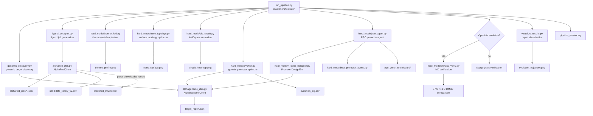

# Geno-Thermal Targeting

Geno-Thermal Targeting is a Python research pipeline for designing and
screening patient-specific magnetic nanoparticle therapies. It combines genomic
target discovery, peptide ligand job generation, synthetic promoter design,
thermo-switch modeling, nanoparticle surface optimization, biological circuit
simulation, and optional OpenMM molecular dynamics verification.

The project is structured as a reproducible command-line workflow. The main
entry point is `run_pipeline.py`; individual stages can also be run directly for
focused experimentation.

## Contents

- [Architecture](#architecture)
- [Project Structure](#project-structure)
- [Quick Start](#quick-start)
- [Running The Pipeline](#running-the-pipeline)
- [Pipeline Stages](#pipeline-stages)
- [Inputs And Outputs](#inputs-and-outputs)
- [Useful Documentation](#useful-documentation)
- [Development Notes](#development-notes)

## Architecture



`run_pipeline.py` stops on required stage failures. OpenMM verification is the
only optional stage: when `openmm` is not installed, the pipeline logs the skip
and continues to final visualization.

## Project Structure

```text
.
├── run_pipeline.py                 # Master pipeline orchestrator
├── genomic_discovery.py            # Phase 1 CLI for genomic target discovery
├── ligand_designer.py              # Phase 2 CLI for AlphaFold job generation/results
├── alphagenome_utils.py            # AlphaGenome API/local-heuristic adapter
├── alphafold_utils.py              # AlphaFold Server job and result utilities
├── visualize_results.py            # Evolution-log plotting
├── summary_report.py               # Lightweight terminal report reader
├── setup.py                        # Editable package metadata
├── requirements.txt                # Core Python dependencies
├── hard_mode/
│   ├── README_HARD_MODE.md         # Hard-mode module guide
│   ├── evolver.py                  # Genetic algorithm promoter optimizer
│   ├── rl_gene_designer.py         # Gymnasium promoter-design environment
│   ├── ppo_agent.py                # Stable-Baselines3 PPO trainer
│   ├── thermo_fold.py              # Thermo-switch optimization model
│   ├── nano_topology.py            # Nanoparticle surface Monte Carlo model
│   ├── bio_circuit.py              # Tumor + heat biological circuit simulation
│   └── physics_verify.py           # Optional OpenMM verification
├── sample_data/                    # Example FASTA/candidate inputs
├── alphafold_jobs/                 # Generated AlphaFold Server job specs
├── alphafold_results/              # Downloaded AlphaFold Server outputs
├── predicted_structures/           # Parsed or selected structure outputs
├── simulated_pdbs/                 # PDB inputs for physics verification
├── CODEBASE_MAP.md                 # GitNexus-generated codebase map
├── AGENTS.md                       # Repo-local agent/development rules
└── CLAUDE.md                       # Companion agent instructions
```

Generated logs, CSVs, images, model checkpoints, and notebook outputs are kept
at the repository root or in the producer-specific output directories listed
below.

## Quick Start

Use Python 3.10 or newer.

```bash
pip install -r requirements.txt
pip install -e .
```

Optional molecular dynamics stack:

```bash
conda install -c conda-forge openmm pdbfixer
```

Run the full workflow:

```bash
python run_pipeline.py
```

## Running The Pipeline

The master orchestrator executes the stages in this order:

1. `python genomic_discovery.py --target_gene EGFR`
2. `python ligand_designer.py --output_csv candidate_library_v2.csv`
3. `python hard_mode/thermo_fold.py`
4. `python hard_mode/nano_topology.py`
5. `python hard_mode/bio_circuit.py`
6. `python hard_mode/evolver.py`
7. `python hard_mode/ppo_agent.py`
8. `python hard_mode/physics_verify.py` when OpenMM is installed
9. `python visualize_results.py`

Each stage writes its own log file. The orchestrator writes
`pipeline_master.log`.

## Pipeline Stages

| Stage | Entry point | Purpose | Main output |
| --- | --- | --- | --- |
| Genomic discovery | `genomic_discovery.py` | Score normal vs mutated sequence context for a target gene through AlphaGenome or local motif heuristics. | `target_report.json` |
| Ligand engineering | `ligand_designer.py` | Generate AlphaFold Server docking jobs and parse available result downloads. | `alphafold_jobs/`, `candidate_library_v2.csv` |
| Thermo-switch design | `hard_mode/thermo_fold.py` | Optimize a simplified leucine-zipper-like switch for temperature-sensitive folding. | `thermo_profile.png` |
| Nanoparticle topology | `hard_mode/nano_topology.py` | Optimize ligand/PEG surface distribution with lattice Monte Carlo annealing. | `nano_surface.png` |
| Biological circuit | `hard_mode/bio_circuit.py` | Simulate tumor-context promoter activity combined with thermal switch activation. | `circuit_heatmap.png` |
| Promoter evolution | `hard_mode/evolver.py` | Evolve tumor- and heat-biased promoter sequences with a genetic algorithm. | `evolution_log.csv` |
| PPO sequence design | `hard_mode/ppo_agent.py` | Train a reinforcement-learning agent over `PromoterDesignEnv`. | `hard_mode/best_promoter_agent.zip` |
| Physics verification | `hard_mode/physics_verify.py` | Optionally compare 37 C and 43 C dynamics with OpenMM. | `physics_verify.log` |
| Visualization | `visualize_results.py` | Plot promoter evolution and convergence behavior. | `evolution_trajectory.png` |

## Running Individual Stages

```bash
python genomic_discovery.py --target_gene EGFR
python ligand_designer.py --output_csv candidate_library_v2.csv
python hard_mode/thermo_fold.py
python hard_mode/nano_topology.py
python hard_mode/bio_circuit.py
python hard_mode/evolver.py
python hard_mode/ppo_agent.py
python hard_mode/physics_verify.py
python visualize_results.py
python summary_report.py
```

`hard_mode/physics_verify.py` uses `simulated_pdbs/unknown_complex.pdb` by
default. PDBFixer is optional but recommended for repairing AlphaFold-style
structures before OpenMM simulation.

## Inputs And Outputs

| Path | Type | Description |
| --- | --- | --- |
| `sample_data/` | Input | Example FASTA and candidate peptide inputs. |
| `target_report.json` | Output | Genomic target and expression report. |
| `candidate_library.csv` | Input/output | Candidate peptide table. |
| `candidate_library_v2.csv` | Output | Updated ligand candidate table from the pipeline. |
| `alphafold_jobs/` | Output | AlphaFold Server JSON job specifications. |
| `alphafold_results/` | Input | Downloaded AlphaFold result ZIPs or directories for parsing. |
| `predicted_structures/` | Output | Selected parsed structure files. |
| `evolution_log.csv` | Output | Genetic algorithm fitness trajectory. |
| `evolution_trajectory.png` | Output | Evolution and mutation-rate visualization. |
| `thermo_profile.png` | Output | Thermo-switch folded-fraction profile. |
| `nano_surface.png` | Output | Optimized nanoparticle surface layout. |
| `circuit_heatmap.png` | Output | Tumor/normal and temperature safety heatmap. |
| `hard_mode/best_promoter_agent.zip` | Output | Trained PPO model checkpoint. |
| `ppo_gene_tensorboard/` | Output | PPO TensorBoard logs. |

## Useful Documentation

| Document | Purpose |
| --- | --- |
| `hard_mode/README_HARD_MODE.md` | Focused guide to the inverse-design and verification scripts in `hard_mode/`. |
| `CODEBASE_MAP.md` | GitNexus-generated architecture map with entry points, modules, artifacts, and index notes. |
| `AGENTS.md` | Repo-local automation and GitNexus rules for coding agents. |
| `CLAUDE.md` | Companion agent instructions mirroring the repo-local workflow rules. |
| `GenoThermal_Resume_Points.md` | Local working notes and resume points; useful for development continuity, not a user-facing API contract. |
| `Geno_Thermal_Master.ipynb` | Notebook version of exploratory pipeline work. |

## Development Notes

- The core workflow is Python-first and command-line runnable.
- `AlphaGenomeClient` supports both API-backed scoring and local heuristic
  fallback behavior.
- `AlphaFoldClient` generates AlphaFold Server jobs locally; server result
  downloads are parsed after they are placed in `alphafold_results/`.
- Molecular dynamics verification requires `openmm`; GPU acceleration depends
  on the local OpenMM CUDA/OpenCL platform setup.
- GitNexus indexes this repository as `Geno-Thermal_Targeting`. Use that repo
  name explicitly when querying the local graph:

```powershell
gitnexus context AlphaGenomeClient -r Geno-Thermal_Targeting
gitnexus impact AlphaGenomeClient -r Geno-Thermal_Targeting
gitnexus cypher -r Geno-Thermal_Targeting "MATCH (n) WHERE toLower(n.name) CONTAINS 'pipeline' OR toLower(n.filePath) CONTAINS 'pipeline' RETURN n.name, n.filePath LIMIT 25"
```
