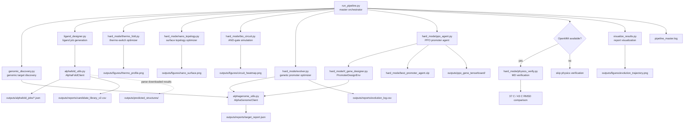

# Geno-Thermal Targeting

<p align="center">
  
</p>


Geno-Thermal Targeting is a Python research pipeline for designing and
screening patient-specific magnetic nanoparticle therapies. It combines genomic
target discovery, peptide ligand job generation, synthetic promoter design,
thermo-switch modeling, nanoparticle surface optimization, biological circuit
simulation, and optional OpenMM molecular dynamics verification.

The project is structured as a reproducible command-line workflow. The main
entry point is `run_pipeline.py`; individual stages can also be run directly for
focused experimentation.

## Contents

- [Key Features](#key-features)
- [Architecture](#architecture)
- [Project Structure](#project-structure)
- [Quick Start](#quick-start)
- [Application Workflow](#application-workflow)
- [Running The Pipeline](#running-the-pipeline)
- [Pipeline Stages](#pipeline-stages)
- [RunPod Flash Layer](#runpod-flash-layer)
- [Claude Science Integration](#claude-science-integration)
- [Configuration](#configuration)
- [Inputs And Outputs](#inputs-and-outputs)
- [Interpreting Results](#interpreting-results)
- [Troubleshooting](#troubleshooting)
- [Useful Documentation](#useful-documentation)
- [Development Notes](#development-notes)

## Key Features

| Capability | What the repo provides |
| --- | --- |
| End-to-end orchestration | `run_pipeline.py` executes the complete research flow and stops on required phase failures. |
| AlphaGenome-backed discovery | `AlphaGenomeClient` can use the real `alphagenome` package and `ALPHAGENOME_API_KEY`, with local fallback when unavailable. |
| Local heuristic fallback | Genomic expression and promoter fitness can run without cloud access for development, demos, and CI-style checks. |
| Session-level fitness caching | Repeated DNA sequence scoring is cached in memory during a run to reduce duplicate API or heuristic calls. |
| AlphaFold Server job generation | `AlphaFoldClient` creates upload-ready AlphaFold Server JSON jobs for receptor/peptide docking batches. |
| AlphaFold result parsing | Downloaded AlphaFold ZIPs or result directories can be parsed into candidate scores and selected structures. |
| Binder classification | Parsed confidence scores can be classified as `STRONG_BINDER`, `MODERATE_BINDER`, `WEAK_BINDER`, or `NON_BINDER`. |
| Genetic promoter optimization | `hard_mode/evolver.py` evolves 200 bp synthetic promoters with elitism, tournament selection, crossover, mutation, and adaptive mutation-rate escalation. |
| RL-based sequence design | `hard_mode/ppo_agent.py` trains a PPO agent over a custom Gymnasium promoter-design environment. |
| Thermo-switch modeling | `hard_mode/thermo_fold.py` tunes a leucine-zipper-like scaffold toward a temperature-sensitive switching window. |
| Nanoparticle surface simulation | `hard_mode/nano_topology.py` uses lattice Monte Carlo annealing to distribute ligand and PEG surface components. |
| Biological safety gate simulation | `hard_mode/bio_circuit.py` models promoter activity multiplied by thermal switch activation across normal/tumor contexts. |
| Optional molecular dynamics | `hard_mode/physics_verify.py` runs OpenMM-based 37 C and 43 C RMSD checks when OpenMM is installed. |
| Publication-style artifacts | The workflow generates JSON reports, CSV trajectories, heatmaps, topology maps, melting profiles, and convergence plots. |

## Architecture



`run_pipeline.py` stops on required stage failures. OpenMM verification is the
only optional stage: when `openmm` is not installed, the pipeline logs the skip
and continues to final visualization.

## Project Structure

```text
.
├── run_pipeline.py                 # Master pipeline orchestrator
├── genomic_discovery.py            # Phase 1 CLI for genomic target discovery
├── ligand_designer.py              # Phase 2 CLI for AlphaFold job generation/results
├── alphagenome_utils.py            # AlphaGenome API/local-heuristic adapter
├── alphafold_utils.py              # AlphaFold Server job and result utilities
├── visualize_results.py            # Evolution-log plotting
├── visualize_structure.py          # py3Dmol interactive 3D structure/docking viewer
├── geno_thermal_master.py          # Headless .py port of Geno_Thermal_Master.ipynb (Phases 1-9 + summary)
├── summary_report.py               # Lightweight terminal report reader
├── setup.py                        # Editable package metadata
├── requirements.txt                # Core Python dependencies
├── hard_mode/
│   ├── README_HARD_MODE.md         # Hard-mode module guide
│   ├── evolver.py                  # Genetic algorithm promoter optimizer
│   ├── rl_gene_designer.py         # Gymnasium promoter-design environment
│   ├── ppo_agent.py                # Stable-Baselines3 PPO trainer
│   ├── thermo_fold.py              # Thermo-switch optimization model
│   ├── nano_topology.py            # Nanoparticle surface Monte Carlo model
│   ├── bio_circuit.py              # Tumor + heat biological circuit simulation
│   └── physics_verify.py           # Optional OpenMM verification
├── flash_boltz.py                  # Flash: Boltz-2 fold + affinity endpoint
├── boltz_designer.py               # Flash: Phase 2 driver (replaces ligand_designer.py)
├── flash_fitness.py                # Flash: self-contained GA fitness fan-out
├── flash_gpu_jobs.py                # Flash: self-contained PPO + OpenMM workers
├── target_panel.py                 # Flash: multi-oncogene selectivity panel
├── fetch_targets.py                # Builds data/sample_data/targets.csv from UniProt
├── leaderboard.py                  # Unified peptide + small-molecule leaderboard
├── bright_data_intel.py            # Flash: live target intel via Bright Data
├── flash_metrics.py                # FanoutMetrics observability/cost accounting
├── flash_dashboard.py              # Renders outputs/figures/flash_scaling.png from metrics
├── preflight.py                    # Local sanity checks (no GPU/Flash needed)
├── make_demo_snapshot.py           # Illustrative demo fallback chart/metrics
├── Makefile                        # Demo runbook entry points (preflight/demo/panel/...)
├── requirements-flash.txt          # Driver-side Flash/dashboard dependencies
├── mcp_geno_thermal.py             # Claude Science MCP server (wraps the pipeline as tools)
├── .mcp.json                       # Registers the geno-thermal-targeting MCP server
├── .claude/
│   └── skills/
│       └── geno-thermal-targeting/ # Claude Science skill: discover -> design -> verify loop
├── data/
│   └── sample_data/                # Example FASTA/candidate/target inputs
├── outputs/
│   ├── alphafold_jobs/              # Generated AlphaFold Server job specs
│   ├── alphafold_results/           # Downloaded AlphaFold Server outputs
│   ├── predicted_structures/        # Parsed or selected structure outputs
│   ├── simulated_pdbs/              # PDB inputs for physics verification
│   ├── reports/                     # Generated CSV/JSON reports (candidate libraries, logs, metrics)
│   ├── figures/                     # Generated PNG charts/heatmaps
│   └── ppo_gene_tensorboard/        # PPO TensorBoard logs
├── CODEBASE_MAP.md                 # GitNexus-generated codebase map
├── METHODS.md                      # Definitions/caveats for every reported metric
├── FLASH_HACKATHON_NOTES.md        # Day-of hackathon build log and demo runbook
├── AGENTS.md                       # Repo-local agent/development rules
└── CLAUDE.md                       # Companion agent instructions
```

Generated CSVs, JSON reports, and chart images are kept under `outputs/`
(`outputs/reports/`, `outputs/figures/`, plus producer-specific subdirectories);
generated logs and notebook outputs are kept at the repository root.

## Quick Start

Use Python 3.10 or newer.

```bash
pip install -r requirements.txt
pip install -e .
```

Optional molecular dynamics stack:

```bash
conda install -c conda-forge openmm pdbfixer
```

Run the full workflow:

```bash
python run_pipeline.py
```

Optional RunPod Flash layer (see [RunPod Flash Layer](#runpod-flash-layer)):

```bash
pip install -r requirements-flash.txt
make preflight          # local sanity checks, no GPU/Flash SDK needed
make demo                # one-shot Flash demo
```

## Application Workflow

The project behaves like a staged research application even though the interface
is currently command-line based:

```mermaid
flowchart LR
    A["Prepare inputs<br/>FASTA + peptide candidates"] --> B["Discover target<br/>expression and epigenetic profile"]
    B --> C["Generate ligand jobs<br/>AlphaFold Server JSON"]
    C --> D["Download/parse structures<br/>confidence-ranked candidates"]
    D --> E["Design control logic<br/>promoter + thermo-switch"]
    E --> F["Optimize carrier<br/>nanoparticle topology"]
    F --> G["Verify biological gate<br/>normal vs tumor, 37 C vs 43 C"]
    G --> H["Optional physics check<br/>OpenMM RMSD comparison"]
    H --> I["Review artifacts<br/>reports, logs, plots, models"]
```



Typical usage pattern:

1. Put sequence inputs in `data/sample_data/`.
2. Run `genomic_discovery.py` to create `outputs/reports/target_report.json`.
3. Run `ligand_designer.py` to generate AlphaFold Server jobs.
4. Upload generated jobs from `outputs/alphafold_jobs/` to AlphaFold Server.
5. Download AlphaFold result ZIPs into `outputs/alphafold_results/`.
6. Rerun `ligand_designer.py` to parse and rank structures.
7. Run hard-mode design stages for promoter, switch, surface topology, and circuit behavior.
8. Run `visualize_results.py` and review generated images/logs.

## Running The Pipeline

The master orchestrator executes the stages in this order:

1. `python genomic_discovery.py --target_gene EGFR`
2. `python ligand_designer.py --output_csv outputs/reports/candidate_library_v2.csv`
3. `python hard_mode/thermo_fold.py`
4. `python hard_mode/nano_topology.py`
5. `python hard_mode/bio_circuit.py`
6. `python hard_mode/evolver.py`
7. `python hard_mode/ppo_agent.py`
8. `python hard_mode/physics_verify.py` when OpenMM is installed
9. `python visualize_results.py`

Each stage writes its own log file. The orchestrator writes
`pipeline_master.log`.

## Pipeline Stages

| Stage | Entry point | Purpose | Main output |
| --- | --- | --- | --- |
| Genomic discovery | `genomic_discovery.py` | Score normal vs mutated sequence context for a target gene through AlphaGenome or local motif heuristics. | `outputs/reports/target_report.json` |
| Ligand engineering | `ligand_designer.py` | Generate AlphaFold Server docking jobs and parse available result downloads. | `outputs/alphafold_jobs/`, `outputs/reports/candidate_library_v2.csv` |
| Thermo-switch design | `hard_mode/thermo_fold.py` | Optimize a simplified leucine-zipper-like switch for temperature-sensitive folding. | `outputs/figures/thermo_profile.png` |
| Nanoparticle topology | `hard_mode/nano_topology.py` | Optimize ligand/PEG surface distribution with lattice Monte Carlo annealing. | `outputs/figures/nano_surface.png` |
| Biological circuit | `hard_mode/bio_circuit.py` | Simulate tumor-context promoter activity combined with thermal switch activation. | `outputs/figures/circuit_heatmap.png` |
| Promoter evolution | `hard_mode/evolver.py` | Evolve tumor- and heat-biased promoter sequences with a genetic algorithm. | `outputs/reports/evolution_log.csv` |
| PPO sequence design | `hard_mode/ppo_agent.py` | Train a reinforcement-learning agent over `PromoterDesignEnv`. | `hard_mode/best_promoter_agent.zip` |
| Physics verification | `hard_mode/physics_verify.py` | Optionally compare 37 C and 43 C dynamics with OpenMM. | `physics_verify.log` |
| Visualization | `visualize_results.py` | Plot promoter evolution and convergence behavior. | `outputs/figures/evolution_trajectory.png` |

## RunPod Flash Layer

A second, parallel set of entry points reimplements the GPU-heavy stages as
[RunPod Flash](https://runpod.io) autoscaling endpoints (0 -> N workers -> 0),
built for a 1-day RunPod Flash hackathon. It is opt-in: set `GENOTHERMAL_FLASH=1`
(or pass `--flash`) and everything else falls back to the local/serial path. See
[`METHODS.md`](METHODS.md) for an honest definition of every reported number, and
[`FLASH_HACKATHON_NOTES.md`](FLASH_HACKATHON_NOTES.md) for the day-of build log and
demo runbook.

| Script | Replaces / extends | Purpose |
| --- | --- | --- |
| `flash_boltz.py` | `alphafold_utils.py` | Boltz-2 fold + binding-affinity endpoint; peptide mode ranks by interface ipTM, ligand mode adds the affinity head (log IC50). |
| `boltz_designer.py` | `ligand_designer.py` | Phase 2 driver — fans every candidate out to `flash_boltz.py` concurrently instead of the manual AlphaFold Server upload/download loop. |
| `flash_fitness.py` | `hard_mode/evolver.py` scoring | Self-contained GA fitness fan-out endpoint (no sibling imports on the worker); removes the `API_MAX_WORKERS` serial bottleneck. |
| `flash_gpu_jobs.py` | `hard_mode/ppo_agent.py`, `hard_mode/physics_verify.py` | Self-contained Phase 8 (PPO, with an N-seed sweep) and Phase 9 (OpenMM verification) Flash workers. |
| `target_panel.py` | — (new) | Folds every candidate against every target in a multi-oncogene panel (EGFR/KRAS/HER2/BRAF) and ranks by `selectivity_margin`. |
| `fetch_targets.py` | — (new) | Builds `data/sample_data/targets.csv` from exact UniProt sequences, domain-trimmed for like-for-like comparison. |
| `leaderboard.py` | — (new) | Unifies peptide and small-molecule hits from the candidate library into one ranked board. |
| `bright_data_intel.py` | — (new) | Live target intelligence via the Bright Data SERP API, fanned out on Flash; degrades to a local stub without a token. |
| `flash_metrics.py` / `flash_dashboard.py` | — (new) | `FanoutMetrics` observability/cost accounting (`flash_metrics.json`) and the rendered concurrency/cost chart (`outputs/figures/flash_scaling.png`). |
| `preflight.py` | — (new) | 12 local sanity checks that exercise every fallback path with no Flash SDK, GPU, or heavy deps. Run first. |
| `make_demo_snapshot.py` | — (new) | Builds an illustrative `outputs/reports/demo_metrics.json` / `outputs/figures/flash_scaling.png` fallback for when a live demo call stalls. |

Common entry points, via `Makefile`:

```bash
make preflight   # 12 local sanity checks (no GPU/Flash) — run this first
make demo        # one-shot judge demo on Flash (smoke + flash + keep-going + dashboard)
make pipeline    # full pipeline on Flash (real workload)
make panel       # multi-oncogene selectivity matrix
make screen      # small-molecule virtual screen (Boltz-2 affinity head)
make board       # unified peptide + small-molecule leaderboard
make intel       # live target intel via Bright Data, fanned out on Flash
make dashboard   # render outputs/figures/flash_scaling.png from recorded metrics
make story        # 3-min demo path: GA fan-out -> panel -> dashboard -> summary
```

Driver-side Flash/dashboard dependencies are listed separately in
`requirements-flash.txt` (worker-side heavy deps stay declared inline in each
`@Endpoint(dependencies=...)` block, not in this file).

## Claude Science Integration

The pipeline is also exposed to Claude as an MCP server, `mcp_geno_thermal.py`,
so the discover -> design -> verify loop can be driven in plain language instead
of by hand-running each CLI stage. Every tool wraps existing project code; none
of it duplicates logic.

| MCP tool | Wraps | Purpose |
| --- | --- | --- |
| `discover_target` | `alphagenome_utils.AlphaGenomeClient` | Scores a genomic locus (SUPER_ENHANCER vs NORMAL + confidence). |
| `design_ligands` | `boltz_designer.py` | Folds/docks candidates with Boltz-2 and returns a ranked binder library. Flags `stale: true` when no local boltz/torch toolchain or Flash run produced fresh results, so a demo can never silently pass off the committed CSV as a live fold. |
| `design_thermal_switch` | `hard_mode/thermo_fold.ThermoSwitchOptimizer` | Evolves a folded(37 C)->unfolded(43 C) thermal-switch protein. |
| `verify_with_bionemo` | NVIDIA BioNeMo Boltz-2 NIM | Independent second-opinion re-fold; degrades to a local heuristic without `NVIDIA_API_KEY`. |
| `run_full_pipeline` | `run_pipeline.py` | Runs all 12 phases end to end (`smoke=True` for a <1-minute demo). |
| `design_promoter_flash` | `hard_mode/evolver.py` | Evolves a hyperthermia-gated promoter; with `use_flash=True` the GA's fitness scoring fans out on the RunPod Flash fleet (0->N->0). `mode` in the response reflects whether Flash genuinely engaged this call, not just what was requested. |
| `screen_and_verify` | the above, chained | One-call discover -> design -> (Flash promoter GA) -> verify loop; the headline demo artifact. |

Registration lives in `.mcp.json` under the server name `geno-thermal-targeting`,
launched with `.venv-flash/bin/python mcp_geno_thermal.py` (the plain `venv/`
interpreter lacks `numpy`/`pandas`/`alphagenome` and cannot run the server). The
companion skill at `.claude/skills/geno-thermal-targeting/SKILL.md` documents
the design loop and the adversarial-verification pattern (only report a
candidate as validated if BioNeMo corroborates the project's own confidence).

Smoke-test the server directly, independent of any MCP client:

```bash
.venv-flash/bin/python mcp_geno_thermal.py --selftest
```

## Configuration

### Environment Variables

| Variable | Used by | Description |
| --- | --- | --- |
| `ALPHAGENOME_API_KEY` | `alphagenome_utils.py`, `genomic_discovery.py`, `hard_mode/evolver.py`, `hard_mode/rl_gene_designer.py` | Enables API-backed AlphaGenome scoring. Without it, the repo falls back to local motif heuristics. |

### Genomic Discovery CLI

```bash
python genomic_discovery.py \
  --input_file data/sample_data/sample_gene.fasta \
  --target_gene EGFR \
  --output_file outputs/reports/target_report.json
```

Arguments:

| Argument | Default | Description |
| --- | --- | --- |
| `--input_file` | `data/sample_data/sample_gene.fasta` | FASTA-like sequence input. Missing files trigger a placeholder sequence fallback. |
| `--target_gene` | `EGFR` | Gene identifier reported in `outputs/reports/target_report.json`. |
| `--output_file` | `outputs/reports/target_report.json` | JSON report destination. |
| `--api_key` | `None` | AlphaGenome API key override; otherwise `ALPHAGENOME_API_KEY` is used. |

### Ligand Designer CLI

```bash
python ligand_designer.py \
  --candidates_file data/sample_data/candidates.csv \
  --output_csv outputs/reports/candidate_library_v2.csv
```

Arguments:

| Argument | Default | Description |
| --- | --- | --- |
| `--target_seq` | Built-in EGFR receptor sequence | Amino acid sequence for the receptor target. |
| `--candidates_file` | `data/sample_data/candidates.csv` | CSV with `name` and `seq` columns. If unavailable or malformed, built-in candidates are used. |
| `--output_csv` | `outputs/reports/candidate_library.csv` | Destination for parsed AlphaFold result scores when local results exist. |

### Hard-Mode Tunables

Most hard-mode controls are constants at the top of each script:

| File | Important settings |
| --- | --- |
| `hard_mode/evolver.py` | `POPULATION_SIZE`, `GENOME_LENGTH`, `GENERATIONS`, `INITIAL_MUTATION_RATE`, `STAGNATION_THRESHOLD`, API worker limits, and scoring weights. |
| `hard_mode/ppo_agent.py` | PPO timesteps, learning rate, batch size, rollout length, and TensorBoard log path. |
| `hard_mode/thermo_fold.py` | `TARGET_TEMP_LOW`, `TARGET_TEMP_HIGH`, `TARGET_TM`, scaffold sequence, population size, generations, and mutation rate. |
| `hard_mode/nano_topology.py` | Grid size, Monte Carlo steps, ligand density, PEG density, and initial simulation temperature. |
| `hard_mode/physics_verify.py` | Default `PDB_FILE`, force field, water model, simulation step count, and report interval. |

## Running Individual Stages

```bash
python genomic_discovery.py --target_gene EGFR
python ligand_designer.py --output_csv outputs/reports/candidate_library_v2.csv
python hard_mode/thermo_fold.py
python hard_mode/nano_topology.py
python hard_mode/bio_circuit.py
python hard_mode/evolver.py
python hard_mode/ppo_agent.py
python hard_mode/physics_verify.py
python visualize_results.py
python summary_report.py
```

`hard_mode/physics_verify.py` uses `outputs/simulated_pdbs/unknown_complex.pdb` by
default. PDBFixer is optional but recommended for repairing AlphaFold-style
structures before OpenMM simulation.

## Inputs And Outputs

| Path | Type | Description |
| --- | --- | --- |
| `data/sample_data/` | Input | Example FASTA and candidate peptide inputs. |
| `outputs/reports/target_report.json` | Output | Genomic target and expression report. |
| `outputs/reports/candidate_library.csv` | Input/output | Candidate peptide table. |
| `outputs/reports/candidate_library_v2.csv` | Output | Updated ligand candidate table from the pipeline. |
| `outputs/alphafold_jobs/` | Output | AlphaFold Server JSON job specifications. |
| `outputs/alphafold_results/` | Input | Downloaded AlphaFold result ZIPs or directories for parsing. |
| `outputs/predicted_structures/` | Output | Selected parsed structure files. |
| `outputs/reports/evolution_log.csv` | Output | Genetic algorithm fitness trajectory. |
| `outputs/figures/evolution_trajectory.png` | Output | Evolution and mutation-rate visualization. |
| `outputs/figures/thermo_profile.png` | Output | Thermo-switch folded-fraction profile. |
| `outputs/figures/nano_surface.png` | Output | Optimized nanoparticle surface layout. |
| `outputs/figures/circuit_heatmap.png` | Output | Tumor/normal and temperature safety heatmap. |
| `outputs/figures/<job_name>_3d.html` | Output | Interactive py3Dmol viewer for a folded/docked structure (from `visualize_structure.py`). |
| `outputs/figures/best_docking_3d.html` | Output | Interactive 3D view of the best-scoring docked candidate (from `geno_thermal_master.py`). |
| `hard_mode/best_promoter_agent.zip` | Output | Trained PPO model checkpoint. |
| `outputs/ppo_gene_tensorboard/` | Output | PPO TensorBoard logs. |

## Interpreting Results

### `outputs/reports/target_report.json`

The genomic discovery report contains the target gene and predicted expression
profile:

- `normal_score`: baseline sequence activity estimate.
- `mutated_score`: patient/mutated sequence activity estimate.
- `classification`: currently `SUPER_ENHANCER` or `NORMAL`.
- `confidence`: confidence score from the active scoring mode.
- `epigenetic_profile`: H3K27ac, H3K4me1, and H3K27me3 summary labels.

### `outputs/reports/candidate_library_v2.csv`

When AlphaFold result ZIPs or directories exist under `outputs/alphafold_results/`, the
ligand parser writes structure confidence summaries:

- `job_name`: docking job identifier.
- `structure_path`: selected best model copied into `outputs/predicted_structures/`.
- `plddt_score`: confidence proxy used for ranking.
- `pae_score`: ranking-score proxy from AlphaFold summary metadata.
- `model_index`: selected model index.

### `outputs/reports/evolution_log.csv`

The promoter optimizer logs one row per generation:

- `Best_Fitness`: best promoter score for the generation.
- `Tumor_Score`: tumor-associated motif contribution.
- `Normal_Score`: off-target normal motif penalty signal.
- `Heat_Score`: heat-shock motif contribution.
- `Mutation_Rate`: adaptive mutation rate used after convergence checks.

### Visual Outputs

| Artifact | What to inspect |
| --- | --- |
| `outputs/figures/evolution_trajectory.png` | Fitness trajectory, tumor/normal/heat component scores, and adaptive mutation-rate changes. |
| `outputs/figures/thermo_profile.png` | Folded fraction and pLDDT-style stability across body temperature, hyperthermia temperature, and designed melting point. |
| `outputs/figures/nano_surface.png` | Ligand and PEG distribution after Monte Carlo surface optimization. |
| `outputs/figures/circuit_heatmap.png` | Kill-switch activation across normal/tumor contexts and 36 C to 45.5 C temperatures. |

## Troubleshooting

| Symptom | Likely cause | Fix |
| --- | --- | --- |
| `alphagenome package not installed. Using local fallback.` | `alphagenome` is missing from the active environment. | Install dependencies or continue with local fallback mode. |
| `No API key provided. Using local fallback.` | `ALPHAGENOME_API_KEY` is not set and `--api_key` was not passed. | Set `ALPHAGENOME_API_KEY` or pass `--api_key`. |
| `No results yet in the results directory.` | AlphaFold jobs were generated, but Server results have not been downloaded into `outputs/alphafold_results/`. | Upload `outputs/alphafold_jobs/*.json` to AlphaFold Server, download ZIPs, place them in `outputs/alphafold_results/`, then rerun `ligand_designer.py`. |
| `OpenMM is not installed.` | Optional MD stack is unavailable. | Install `openmm` and optionally `pdbfixer` from conda-forge. |
| `outputs/simulated_pdbs/unknown_complex.pdb` not found | Default MD input is absent. | Place a valid PDB at that path or update `PDB_FILE` in `hard_mode/physics_verify.py`. |
| `outputs/reports/evolution_log.csv not found` | Visualization was run before promoter evolution. | Run `python hard_mode/evolver.py` before `python visualize_results.py`. |
| PPO training is slow | PPO runs sequence episodes and reward evaluation; API mode can add latency. | Use local fallback for development, lower timesteps in `hard_mode/ppo_agent.py`, or run longer jobs on a suitable machine. |
| MCP server fails to launch / Claude can't find the tools after moving to a new machine | `.mcp.json`'s `command`/`args` are absolute paths hardcoded to the machine that created them, and `.mcp.json` is gitignored (not committed). | Run `python scripts/regen_mcp_json.py` from the project root to rewrite the paths for the current machine. |

## Useful Documentation

| Document | Purpose |
| --- | --- |
| `hard_mode/README_HARD_MODE.md` | Focused guide to the inverse-design and verification scripts in `hard_mode/`. |
| `CODEBASE_MAP.md` | GitNexus-generated architecture map with entry points, modules, artifacts, and index notes. |
| `METHODS.md` | Auditable definitions and honesty caveats for every metric the pipeline and Flash layer report. |
| `FLASH_HACKATHON_NOTES.md` | Day-of RunPod Flash hackathon build log, pre-flight checklist, and demo runbook. |
| `.claude/skills/geno-thermal-targeting/SKILL.md` | Claude Science skill: the discover -> design -> verify design loop and reporting rules. |
| `AGENTS.md` | Repo-local automation and GitNexus rules for coding agents. |
| `CLAUDE.md` | Companion agent instructions mirroring the repo-local workflow rules. |
| `GenoThermal_Resume_Points.md` | Local working notes and resume points; useful for development continuity, not a user-facing API contract. |
| `Geno_Thermal_Master.ipynb` | Notebook version of the narrative AlphaFold-Server-based pipeline, with inline teaching commentary. `geno_thermal_master.py` is the headless script port of the same flow. |

## Development Notes

- The core workflow is Python-first and command-line runnable.
- `AlphaGenomeClient` supports both API-backed scoring and local heuristic
  fallback behavior.
- `AlphaFoldClient` generates AlphaFold Server jobs locally; server result
  downloads are parsed after they are placed in `outputs/alphafold_results/`.
- Molecular dynamics verification requires `openmm`; GPU acceleration depends
  on the local OpenMM CUDA/OpenCL platform setup.
- GitNexus indexes this repository as `Geno-Thermal_Targeting`. Use that repo
  name explicitly when querying the local graph:

```powershell
gitnexus context AlphaGenomeClient -r Geno-Thermal_Targeting
gitnexus impact AlphaGenomeClient -r Geno-Thermal_Targeting
gitnexus cypher -r Geno-Thermal_Targeting "MATCH (n) WHERE toLower(n.name) CONTAINS 'pipeline' OR toLower(n.filePath) CONTAINS 'pipeline' RETURN n.name, n.filePath LIMIT 25"
```
