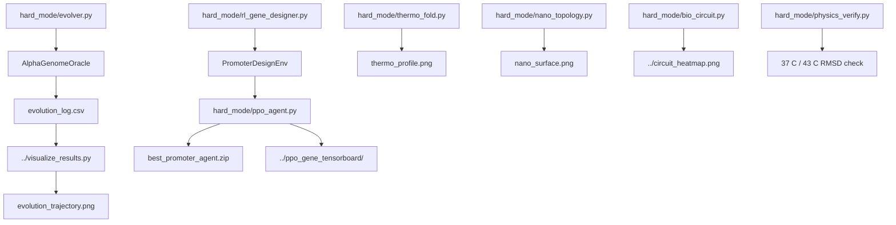

# Hard Mode Research Stack

`hard_mode/` contains the inverse-design and verification modules used by the
main Geno-Thermal pipeline. These scripts can run through `run_pipeline.py` or
individually while developing a specific design stage.



## Components

| Script | Purpose | Output |
| --- | --- | --- |
| `evolver.py` | Genetic algorithm for tumor-biased and heat-responsive promoter sequences. Uses motif/API scoring, elitism, tournament selection, crossover, mutation, and adaptive mutation-rate escalation after stagnation. | `../evolution_log.csv` |
| `rl_gene_designer.py` | Gymnasium environment where an agent writes DNA one nucleotide at a time and receives terminal biological-fitness reward. | Imported by `ppo_agent.py` |
| `ppo_agent.py` | Stable-Baselines3 PPO trainer and generator for promoter sequence design. | `best_promoter_agent.zip`, `../ppo_gene_tensorboard/` |
| `thermo_fold.py` | Thermo-switch optimizer using a simplified two-state folding model for a leucine-zipper-like scaffold. | `../thermo_profile.png` |
| `nano_topology.py` | Lattice Monte Carlo optimizer for ligand/PEG nanoparticle surface topology. | `../nano_surface.png` |
| `bio_circuit.py` | Tumor-context plus hyperthermia AND-gate simulation. | `../circuit_heatmap.png` |
| `physics_verify.py` | Optional OpenMM verification of thermal switching behavior at 37 C and 43 C. | `physics_verify.log` |

## Run From Repository Root

```bash
python hard_mode/evolver.py
python hard_mode/ppo_agent.py
python hard_mode/thermo_fold.py
python hard_mode/nano_topology.py
python hard_mode/bio_circuit.py
python hard_mode/physics_verify.py
```

`physics_verify.py` requires OpenMM and expects
`simulated_pdbs/unknown_complex.pdb` by default. PDBFixer is optional but
recommended for repairing AlphaFold-style structures before simulation.
